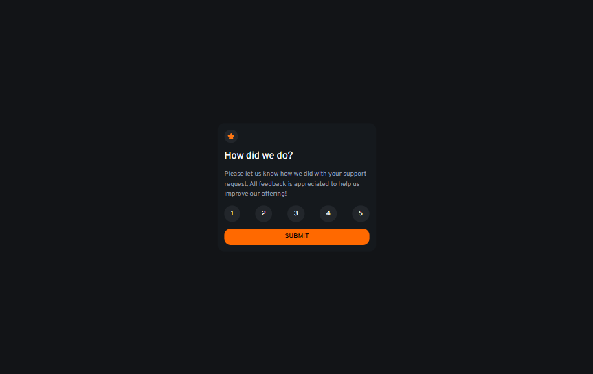

# Frontend Mentor - Interactive rating component solution

This is a solution to the [Interactive rating component challenge on Frontend Mentor](https://www.frontendmentor.io/challenges/interactive-rating-component-koxpeBUmI). Frontend Mentor challenges help you improve your coding skills by building realistic projects.

## Table of contents

- [The challenge](#the-challenge)
- [Screenshot](#screenshot)
- [Links](#links)
  - [Built with](#built-with)
  - [What I learned](#what-i-learned)
  - [Continued development](#continued-development)
  - [Useful resources](#useful-resources)
- [Author](#author)
- [Acknowledgments](#acknowledgments)

**Note: Delete this note and update the table of contents based on what sections you keep.**

## Overview

### The challenge

Users should be able to:

- View the optimal layout for the app depending on their device's screen size
- See hover states for all interactive elements on the page
- Select and submit a number rating
- See the "Thank you" card state after submitting a rating

### Screenshot


.png>)

### Links

- Solution URL: [Add solution URL here](https://your-solution-url.com)
- Live Site URL: [live site URL here](https://jeanclaude09-dev.github.io/interactive-rating-component-main/)

### Built with

- Semantic HTML5 markup
- CSS custom properties
- Tailwind css
- JavaScript

### What I learned

- It is possible to create your own tailwind classes using `@theme` and adding your classes depending on their usage (font, color,...)

```css
@theme {
}
```

- It is possible to get element with their attributes like it is the case with the exemple bellow

```html
<button data-rate="1">1</button>
<button data-rate="2">2</button>
<button data-rate="3">3</button>
```

```js
const ratingButton = document.querySelectorAll("[data-rate]");
```

- `element.textcontent`: used to get or set the text content of a specified HTML element and all its descendant nodes

```js
selectedRating.textContent = currentRating + " ";
```

### Continued development

- DOM manipulation
- Method
- Tailwind configuration
- Hyprland

### Useful resources

- [Mdn web documentation](https://developer.mozilla.org/en-US/)

## Author

- Frontend Mentor - [@jeanclaude09-dev](https://www.frontendmentor.io/profile/jeanclaude09-dev)
- Twitter - [@iamjeanclaude09](https://www.twitter.com/iamjeanclaude09)
- Github - [@jeanclaude09-dev](https://github.com/Jeanclaude09-dev)
